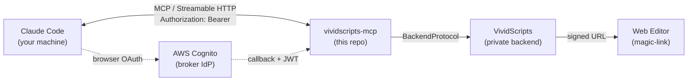

# vividscripts-mcp

> A remote MCP server that lets you produce a finished video — narration, illustration, sound effects, music, and final assembly — by talking to [Claude Code](https://claude.com/claude-code). You guide the creative; Claude reasons; this server runs the pipeline.

[](https://github.com/EstebanCastorena/vividscripts-mcp/actions/workflows/ci.yml)
[](https://www.python.org/downloads/)
[](LICENSE)


## Try it (about 60 seconds)

1. **Sign up** at [app.vividscripts.com](https://app.vividscripts.com/) — Google sign-in via Cognito, no credit card.
2. **Connect Claude Code.** Drop this into your project's `.mcp.json` (or `~/.claude.json`):

   ```json
   {
     "mcpServers": {
       "vividscripts": {
         "type": "http",
         "url": "https://app.vividscripts.com/mcp"
       }
     }
   }
   ```

   Then in Claude Code run `/mcp` and authorize VividScripts. One browser round-trip; no API keys, no tokens to paste.

3. **Paste a story** into Claude Code and ask it to make a video. Claude drives the 16-step pipeline; you watch the scenes light up. When it's done, the server hands back a single click-through URL that opens the finished project in the editor — already signed in.

See [`examples/claude-code-demo.md`](examples/claude-code-demo.md) for the full walkthrough with screenshots and a sample story.

## What makes this interesting

This is the bridge between Claude Code's reasoning and VividScripts' media pipeline. The interesting bits, in order of how much they tend to be over-simplified:

- **OAuth 2.1 + Cognito broker, no API keys.** The server is RFC-strict ([6749](https://www.rfc-editor.org/rfc/rfc6749), [6750](https://www.rfc-editor.org/rfc/rfc6750), [7591](https://www.rfc-editor.org/rfc/rfc7591), [7636](https://www.rfc-editor.org/rfc/rfc7636), [8252](https://www.rfc-editor.org/rfc/rfc8252), [9728](https://www.rfc-editor.org/rfc/rfc9728)). It exposes Dynamic Client Registration so Claude Code self-registers; PKCE is required on every flow; the browser login is delegated to AWS Cognito; the server validates Cognito-signed JWTs against the JWKS without re-signing anything. End result: one browser round-trip, then Claude Code is in. Full flow walkthrough in [`docs/auth.md`](docs/auth.md).

- **Magic-link handoff from chat to editor.** When the pipeline finishes the server mints a short-lived HS256-signed URL (≤ 5 min TTL, single-use via `jti` cache, algorithm pinned, token scrubbed from logs and browser history). Clicking it opens the editor with the project loaded and the user already authenticated — Vercel-style single click from "video ready" to "viewing the result". Threat model and rotation playbook in [`docs/magic-link.md`](docs/magic-link.md).

- **Async-job media pipeline.** Long media operations (TTS, image gen, SFX, music, animation, compile) return a `job_id` immediately. Progress streams back over the MCP transport — no polling loops in Claude Code, no half-stuck `/mcp` request waiting on FFmpeg. Persisted server-side so workflows survive disconnects.

- **20 MCP Prompts as the integration contract.** Every AI consultation point in the pipeline is an MCP Prompt with a JSON-Schema-bound input and a JSON-Schema-validated output. Each surfaces as a `/slash-command` in Claude Code. The template **bodies** stay in the private backend (creative IP); the public package ships only the **interfaces** — which is the contract that matters for integration. One of them (`resume_project`) is a public **runbook prompt**: if your MCP session dies mid-pipeline, ask Claude to use the `resume_project` prompt and it walks you through picking up where the previous session left off. Reference: [`docs/prompts.md`](docs/prompts.md).

- **Security as a default, not a bolt-on.** 565-test suite including a 232-test security regression block written against the [2026-05-17 third-party audit](#security). `bandit` and `pip-audit` gate every PR. `BackendProtocol` makes cross-tenant access impossible by construction (every method's first argument is `user_id`, sourced only from a validated Bearer token via a `contextvars`-scoped middleware — a tool that tries to read `user_id` from a request body fails type-check). Full design in [`docs/security.md`](docs/security.md).

- **Pluggable backend.** The MCP tool layer talks to a structural [`BackendProtocol`](src/vividscripts_mcp/adapters/base.py). Production injects a real backend that calls VividScripts directly; this package ships [`MockBackend`](src/vividscripts_mcp/adapters/mock.py) for tests and protocol-level debugging.

## Architecture in one diagram



Two layers connected by MCP. The **intelligence** layer (Claude Code) does all the reasoning — story analysis, scene grouping, image prompts, sound-effect selection. The **infrastructure** layer (VividScripts) handles every media operation — TTS, image gen, SFX, music, compilation, storage. The package in this repo is the bridge. Full design in [`docs/architecture.md`](docs/architecture.md).

## Security

| Surface | Mechanism | Reference |
|---|---|---|
| Authentication | OAuth 2.1 + DCR + PKCE, JWT validation against Cognito JWKS | [`docs/auth.md`](docs/auth.md) |
| Authorization | `user_id` sourced only from validated Bearer token; cross-tenant returns 404, not 403 | [`docs/security.md`](docs/security.md) |
| URL handoff | HS256 JWT, 5-min TTL, single-use via `jti` cache, fails closed | [`docs/magic-link.md`](docs/magic-link.md) |
| Static analysis | `bandit` (blocking) + `pip-audit` (advisory) on every PR | [`.github/workflows/ci.yml`](.github/workflows/ci.yml) |
| Regression coverage | 232 tests written against the 2026-05-17 audit closure (KAN-93 → KAN-98) | [`CHANGELOG.md`](CHANGELOG.md) |

For vulnerability reporting, see [`SECURITY.md`](SECURITY.md).

## Developer-side appendix

If you want to inspect MCP wire traffic or develop the protocol surface itself, this repo ships [`MockBackend`](src/vividscripts_mcp/adapters/mock.py), an in-memory backend that satisfies the full `BackendProtocol` and is what the test suite runs against. It is **not** the user-facing path — end users go through [app.vividscripts.com](https://app.vividscripts.com/) — but it lets you boot the server with no external dependencies, drive the OAuth dance with `curl`, and watch tools dispatch deterministically.

```bash
git clone https://github.com/EstebanCastorena/vividscripts-mcp.git
cd vividscripts-mcp
python -m venv .venv
. .venv/bin/activate    # Windows: .venv\Scripts\activate
pip install -e ".[dev]"
pre-commit install
pytest                  # 565 tests
```

Full walkthrough — running the local server, exercising the offline OAuth path, calling tools by hand — in [`examples/local-dev.md`](examples/local-dev.md). Tool / Prompt catalog in [`docs/tools.md`](docs/tools.md).

Type-checked with `mypy --strict`, linted and formatted with `ruff`. Python 3.11+.

## License

MIT — see [`LICENSE`](LICENSE).

## Related

- VividScripts: [vividscripts.ai](https://vividscripts.ai/)
- Model Context Protocol: [modelcontextprotocol.io](https://modelcontextprotocol.io)
- Anthropic MCP Python SDK: [github.com/modelcontextprotocol/python-sdk](https://github.com/modelcontextprotocol/python-sdk)
