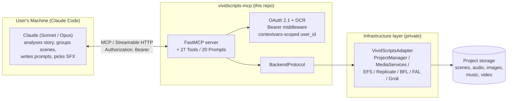
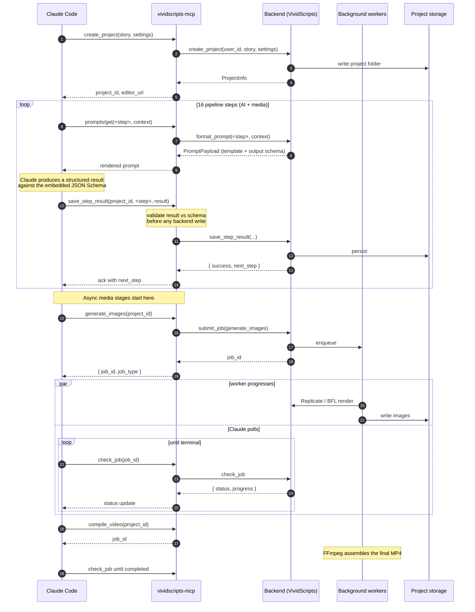

# Architecture

How `vividscripts-mcp` is put together, and why. Three flows do most of the work: the OAuth handshake, the 16-step pipeline, and the magic-link handoff. Each gets its own sequence diagram below, with the design rationale alongside.

## The two-layer split



**Intelligence layer** (top): Claude Code. All reasoning lives here — story analysis, scene splitting, title writing, character consistency, image prompt composition, sound-effect selection. Claude calls a structured MCP Prompt, fills in the schema, and posts a structured result back via `save_step_result`. The model never touches an HTTP endpoint that isn't an MCP tool.

**Infrastructure layer** (bottom): VividScripts. All media work — text-to-speech, word-level transcription, image generation, sound-effect generation, music, video compilation, project storage. None of it lives in this repo; the production backend reaches it via a `VividScriptsAdapter` that satisfies `BackendProtocol`.

This repo is the bridge. It does three things:

1. **Authenticates the client and the user** without asking the user to paste anything (`docs/auth.md`).
2. **Translates MCP traffic to a typed backend contract** (`adapters/base.py`). The MCP tool layer never imports anything that knows about VividScripts internals; it calls protocol methods. Tests inject `MockBackend`, production injects the real one. There is no third path.
3. **Returns a click-through URL when work finishes** so the user goes from "video ready" to "viewing the editor" in one click (`docs/magic-link.md`).

## Pluggable backends

The MCP tool layer never talks to VividScripts directly. It talks to a [`BackendProtocol`](../src/vividscripts_mcp/adapters/base.py) — a structural type with ~20 methods covering projects, workflow state, prompts, async jobs, scenes, and URL handoff.

| Backend | Where it lives | Used for |
|---------|----------------|----------|
| `MockBackend` | This repo (`src/vividscripts_mcp/adapters/mock.py`) | Tests; local protocol development; reviewer demos that don't need real media |
| Production adapter | Separate private repo | Real VividScripts integration with Replicate / BFL / FAL / Grok |

Tools are constructed by [closure factories](../src/vividscripts_mcp/tools/projects.py) — `make_create_project_tool(backend) -> Callable`. The factory hides the backend from the tool's MCP-visible input schema, so the wire contract a client sees is the same regardless of which backend is wired up.

## MCP primitives

The server uses the MCP primitives as the spec intends.

### Tools (27) — actions with side effects

| Group | Tools | Notes |
|---|---|---|
| Project | `create_project`, `list_projects`, `get_project` | user-scoped, KeyError → 404-shaped error |
| Workflow state | `save_step_result`, `get_workflow_state`, `list_workflow_steps` | schema-validates results before persisting |
| Custom prompts | `set_custom_prompt_override`, `get_custom_prompt_override` | rejects unknown step names |
| Media (async) | `generate_audio`, `generate_images`, `generate_sfx`, `generate_thumbnail`, `animate_scene`, `generate_music`, `compile_video`, `regenerate_scene_image`, `regenerate_scene_audio` | return `job_id`; poll `check_job` |
| Media (sync) | `select_music`, `check_job` | |
| Scenes | `get_scenes`, `get_scene`, `update_scene_prompt`, `update_scene_text`, `add_scene`, `remove_scene` | bidirectional with the editor |
| Handoff | `mint_magic_link`, `get_video_download_url` | short-lived signed URLs |

Full catalog with parameters and examples: [`docs/tools.md`](tools.md).

### Prompts (20) — parameterized templates

The 20 AI consultation points in the VividScripts pipeline are exposed as MCP Prompts (`prompts/list`, `prompts/get`). Each surfaces as a `/slash-command` in Claude Code, and can also be retrieved programmatically while the workflow is being driven autonomously.

The template **bodies** are served by the production backend (where they live as private IP); the public package declares only the prompt **interfaces** (name, input/output schemas, descriptions). Custom user overrides are layered on top before the rendered prompt is returned. The 20 input schemas live in [`src/vividscripts_mcp/prompts/definitions.py`](../src/vividscripts_mcp/prompts/definitions.py); the 20 output schemas live in [`src/vividscripts_mcp/schemas/`](../src/vividscripts_mcp/schemas/).

### Resources

Not yet exposed in the v1.0 surface. The URI scheme is reserved for a future minor release that will let Claude Code subscribe to live status (`vividscripts://jobs/{job_id}`, `vividscripts://projects/{id}/state`) instead of polling `check_job`. For now, async media work uses the `job_id` + `check_job` polling pattern that v1.0 ships with.

## OAuth 2.1 + Cognito broker

```mermaid
sequenceDiagram
    autonumber
    participant CC as Claude Code
    participant MCP as vividscripts-mcp
    participant Cog as AWS Cognito Hosted UI
    participant U as User (browser)

    CC->>MCP: POST /mcp (no auth)
    MCP-->>CC: 401 + WWW-Authenticate: Bearer<br/>resource_metadata="...prm"

    CC->>MCP: GET /.well-known/oauth-protected-resource
    MCP-->>CC: 200 + PRM JSON (RFC 9728)

    CC->>MCP: POST /oauth/register (RFC 7591)
    Note over MCP: DCR is open in broker mode<br/>(Cognito is the real auth gate)
    MCP-->>CC: 201 + client_id

    Note over CC: generate code_verifier<br/>code_challenge = base64url(sha256(verifier))

    CC->>U: open browser to /oauth/authorize?<br/>code_challenge=...&state=...
    U->>MCP: GET /oauth/authorize
    MCP-->>U: 302 to Cognito Hosted UI<br/>(Google federation)

    U->>Cog: sign in
    Cog-->>U: 302 to /oauth/callback
    U->>MCP: /oauth/callback?code=...
    MCP-->>U: 302 to client redirect_uri<br/>?code=AUTH_CODE&state=...

    U-->>CC: loopback delivers the code

    CC->>MCP: POST /oauth/token<br/>grant_type=authorization_code<br/>code=AUTH_CODE&code_verifier=...
    Note over MCP: PKCE verify;<br/>exchange with Cognito;<br/>pass tokens through unchanged
    MCP-->>CC: 200 + access_token (Cognito JWT) + refresh_token

    CC->>MCP: POST /mcp<br/>Authorization: Bearer <access_token>
    Note over MCP: validate JWT via Cognito JWKS:<br/>RS256 pinned, aud/iss/token_use/exp checked
    MCP-->>CC: 200 + MCP session, tool calls flow
```

**Design notes.**

- **PKCE required.** Any `/oauth/authorize` without `code_challenge` returns `400 invalid_request`; `code_challenge_method` must be `S256`. Any `/oauth/token` without `code_verifier` returns `400`. No fallback.
- **Broker mode, not re-signing.** With `CognitoConfig` injected, the server passes Cognito's own access and refresh tokens through unchanged. Bearer validation checks Cognito-signed JWTs against the JWKS (cached 1 hour, RS256 pinned, `aud` / `iss` / `token_use` / `exp` all verified). Fewer keys to manage, fewer points of failure.
- **Offline mode for tests and local dev.** With `cognito=None` the server mounts a mock IdP at `/_mock_idp/login` and signs its own tokens with a process-local RSA key. The offline path refuses to boot unless `VIVIDSCRIPTS_ALLOW_OFFLINE_AUTH=1` is set; binding to a non-loopback host additionally requires `VIVIDSCRIPTS_ALLOW_OFFLINE_NETWORK=1`. Both flags use strict `"1"` matching to avoid the "I set it to false but you took it as truthy" footgun.
- **`redirect_uri` is exact-match per client.** No prefix matching, no wildcards, no host globs. A request with an unregistered `redirect_uri` is rejected before any browser redirect happens — the code never reaches an attacker-controlled URL.
- **The `Authorization` header is never logged.** The audit logger writes a `jti` (when present) or the first 16 hex chars of the token's SHA-256, never the raw token.

Full walkthrough and curl-driven try-it-yourself: [`docs/auth.md`](auth.md).

## Workflow pipeline + async jobs



**Why async jobs.** TTS, image gen, music, and video compile take seconds-to-minutes each. A single MCP request that blocks until the FFmpeg pass finishes would lock up the transport, hide progress from Claude Code, and make crash recovery brittle. The pattern is:

- Every long-running operation has a `generate_*` Tool that returns a `job_id` immediately.
- Workers run in the backend's process; status is persisted on disk so the work survives crashes and session disconnects.
- Claude Code calls `check_job(job_id)` to surface progress and result. The MCP transport stays unblocked; the user sees live progress in chat.
- On `completed`, `JobStatus.result` carries the artifact (e.g. `video_path`). On `failed`, `JobStatus.error` carries the cause.

**Why schema-validated step results.** `save_step_result` runs the result against the step's JSON Schema *before* the backend is touched. On a mismatch, it returns `success=False` with field-level paths and persists nothing. This is what lets Claude self-correct mid-pipeline without contaminating state — the same property that makes the 16-step workflow safe to drive autonomously.

The full prompt catalog (input fields, output schema, loop unit, dependencies) is in [`docs/prompts.md`](prompts.md).

## Magic-link handoff

```mermaid
sequenceDiagram
    autonumber
    participant CC as Claude Code
    participant MCP as vividscripts-mcp
    participant BE as Backend (mint side)
    participant U as User (browser)
    participant R as /m/&lt;token&gt; (redeem side)
    participant E as Editor

    CC->>MCP: mint_magic_link(project_id, view=editor)
    MCP->>BE: mint(sub, project, view, ttl≤300s)
    Note over BE: HS256-sign JWT:<br/>{ sub, project, view, jti(v4), iat, exp, purpose=magic_link }<br/>alg pinned to ["HS256"], TTL hard-capped at 5 min
    BE-->>MCP: (url, expires_at)
    MCP-->>CC: { url, expires_at }

    CC-->>U: presents the URL
    U->>R: GET /m/<jwt>
    Note over R: verify sig + exp + purpose<br/>(alg-list pinned, never read from header)
    R->>R: jti seen? -> 410 Gone
    R->>R: record jti (single-use)
    R->>R: redact token from access log path
    R-->>U: 302 /studio?project=...<br/>Referrer-Policy: no-referrer
    U->>E: load project
    Note over E: scrub token from URL bar
```

**Why a signed JWT instead of an opaque token.** An opaque token needs a server-side lookup row (token → session) that has to be written on mint, read on redeem, kept consistent across processes, and garbage-collected. A signed JWT is *stateless on mint*: the claims (who, which project, which view, when it expires) travel inside the token and are verified by signature, so the mint side needs no storage and the token works the moment it is created — including when minted from a different process than the one that redeems it.

The one thing a JWT cannot do by itself is *single-use*. That is handled with a small redeemed-`jti` cache that fails **closed** (key or cache unavailable → reject). Everything else — expiry, integrity, audience — is in the signature.

**The hard guarantees** (each one enforced in code and covered by tests):

- TTL ≤ 5 minutes, hard-capped at mint.
- Algorithm pinned to a single-element allow-list `["HS256"]`; `none` impossible.
- `purpose: magic_link` isolates these tokens from the app's RS256 access tokens.
- 122-bit v4 `jti`; replay rejected.
- Token never logged (only `jti`); path scrubbed from access logs.
- `Referrer-Policy: no-referrer` on the redemption response so the token can't leak via `Referer`.
- Browser URL is replaced with the clean canonical path so the token isn't left in history.
- Friendly "link expired or already used" page on every failure — no oracle about which check failed.

Full token format, rotation playbook, and TTL rationale: [`docs/magic-link.md`](magic-link.md).

## Authorization: every request scoped to the authenticated user

Every `BackendProtocol` method takes `user_id` as its first parameter. That value is read **only** from the validated Bearer token — never from a request body, query string, or any header other than `Authorization`. The plumbing:

1. `BearerEnforcementMiddleware` validates the access token (RS256 against the JWKS, audience, issuer, expiry).
2. On success, the validated claims are written to a `contextvars` slot.
3. Tool handlers read `require_user_claims().sub` and pass it to the backend.

A new tool that tries to accept `user_id` from the request body fails `mypy --strict`, because the protocol method has `user_id: str` positional-first. Cross-tenant access is impossible by construction: a tool call against another user's `project_id` returns a 404 (project not found *for this user*), never a permission error — so probing doesn't even reveal that other users' projects exist.

`project_id` itself is regex-validated at the protocol boundary (`^[A-Za-z0-9_-]+(?: \(\d+\))?$`). Path traversal attempts (`../`, null bytes, unicode confusables) are rejected with `400` before reaching the backend.

## Test coverage

The 565-test suite is organized as:

- **`tests/unit/`** — module-level tests for every OAuth surface, every tool factory, the schema validator, the workflow state machine, and the prompt registry.
- **`tests/integration/`** — full-ASGI integration tests that drive the OAuth dance with `httpx.AsyncClient`. [`test_oauth_to_create_project.py`](../tests/integration/test_oauth_to_create_project.py) is the canonical end-to-end walkthrough — the closest "real OAuth client talking to a real server" experience without leaving the repo.

A 232-test regression block was added during the 2026-05-17 security audit closure (KAN-93 → KAN-98). It encodes every audit finding as an executable assertion, so a regression that re-introduces the vulnerability would re-open the audit. The audit register itself is private; the regressions are public.

## Reading order

If you're picking this up fresh:

1. This document (you're here) — what the pieces are and why.
2. [`docs/auth.md`](auth.md) — full OAuth flow if you'll touch the auth surface.
3. [`docs/security.md`](security.md) — threat model and design choices.
4. [`docs/tools.md`](tools.md) — Tool and Prompt catalog with parameters and example calls.
5. [`tests/integration/test_oauth_to_create_project.py`](../tests/integration/test_oauth_to_create_project.py) — the OAuth-to-MCP-tool dance as executable code.
