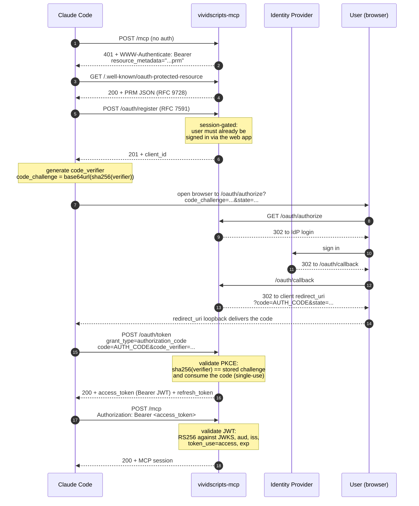

# Authentication

> How Claude Code authenticates with `vividscripts-mcp` — the full OAuth 2.1 dance, the security guarantees, and how to drive it by hand.

## Why this design

A remote MCP server has to authenticate the client *and* the user, and it has to do that without asking the user to paste tokens into a terminal. The OAuth 2.1 authorization-code flow with Dynamic Client Registration solves this:

- **No pre-shared client credentials.** Claude Code registers itself the first time it connects ([RFC 7591](https://www.rfc-editor.org/rfc/rfc7591)). The user never sees a client ID or secret.
- **PKCE on every flow** ([RFC 7636](https://www.rfc-editor.org/rfc/rfc7636)). The authorization code is bound to a verifier that only the client knows, so an intercepted code is useless.
- **The user only sees a browser login.** Same identity provider the web app uses; same credentials. After authorizing once, Claude Code holds a refresh token and re-authenticates silently.

These are the same primitives that production-grade remote MCP servers (Cloudflare's gateway, the Anthropic spec examples) rely on. Following the RFCs strictly means any spec-conformant MCP client should connect without bespoke configuration.

## The flow



### Step-by-step

| Step | Endpoint | What it does |
|------|----------|--------------|
| 1–2 | `POST /mcp` → `GET /.well-known/oauth-protected-resource` | Discovery. An unauthenticated request to the MCP endpoint earns a `401` whose `WWW-Authenticate` header points the client at the Protected Resource Metadata document ([RFC 9728](https://www.rfc-editor.org/rfc/rfc9728)). The PRM lists the authorization servers, supported scopes, and the signing algorithms used for access tokens. |
| 3 | `POST /oauth/register` | Dynamic Client Registration. The client posts its metadata (`redirect_uris`, `client_name`, the grant types it wants). The server validates that every `redirect_uri` is HTTPS or a loopback address ([RFC 8252](https://www.rfc-editor.org/rfc/rfc8252) for native apps), assigns a fresh `client_id`, and persists the registration. Registration requires a prior browser session — an unauthenticated DCR request is rejected with 401. |
| 4 | _(client-side)_ | The client generates a random `code_verifier`, then derives the `code_challenge` as the base64url-encoded SHA-256 of the verifier. The server only ever sees the challenge. |
| 5 | `GET /oauth/authorize` | The browser hits the authorize endpoint with `client_id`, `redirect_uri`, `response_type=code`, the `code_challenge`, and a CSRF `state` nonce. The server verifies that the `redirect_uri` exactly matches one the client registered (no prefix, no wildcard) and redirects the browser to the identity provider. |
| 6 | _(IdP)_ | The user signs in with their existing account. The IdP redirects back to the MCP server's callback URL. |
| 7 | `POST /oauth/token` | The client exchanges the auth code for an access token. It includes the `code_verifier`; the server recomputes `sha256(verifier)` and compares it against the stored challenge. Mismatches return `invalid_grant`. The code is consumed on the first successful exchange — a replay returns `invalid_grant`. |
| 8 | `POST /mcp` with `Authorization: Bearer …` | Every MCP call carries the access token. The server validates the JWT against the JWKS document, checking the signature, audience, issuer, `token_use`, and expiry. Invalid or absent tokens earn a `401` whose `WWW-Authenticate` header includes `error="invalid_token"`. |

## Security guarantees

These guarantees are enforced in code, with tests for each one. Defeating any of them requires defeating the corresponding RFC, not bypassing a configuration toggle.

| Guarantee | Mechanism | What it stops |
|-----------|-----------|---------------|
| **PKCE is required.** No `code_challenge` → `400 invalid_request`. `code_challenge_method` must be `S256`; `plain` and missing values are both rejected. At token exchange, missing `code_verifier` → `400`, mismatched verifier → `400 invalid_grant`. | Validated at `/oauth/authorize` and `/oauth/token`. | Authorization-code interception attacks ([RFC 7636 § 1](https://www.rfc-editor.org/rfc/rfc7636#section-1)). |
| **Auth codes are single-use and short-lived.** The store pops the entry on consume; a replayed code can't be redeemed even if it hasn't expired yet. TTL is 10 minutes. | `MockAuthCodeStore.consume()` (or the production equivalent). | Code replay, especially under attacker-controlled time skew. |
| **`redirect_uri` is exact-match.** No prefix, no glob, no host-wildcard. A request whose `redirect_uri` is not one of the client's registered values returns `400` without redirecting — never hand the code (or an error message describing the code) to an unverified URL. | Validated at registration and at `/oauth/authorize`. | Open-redirect attacks, account takeover via attacker-controlled callback. |
| **Access tokens are validated cryptographically.** Signatures are checked with `algorithms=["RS256"]` only — no fallback to HMAC, no `"none"` acceptance. `aud`, `iss`, `token_use`, and `exp` are all checked. Tokens with an unknown `kid` are rejected. | `validate_bearer_token` in [`oauth/bearer.py`](../src/vividscripts_mcp/oauth/bearer.py). | Algorithm-confusion attacks, JWKS rollover gone wrong, ID-token-as-access-token misuse. |
| **DCR is gated.** A prior browser session is required to register a client. The endpoint emits an audit log entry on every successful registration with the registering user, the new `client_id`, and the registered `redirect_uris`. | Validated at `/oauth/register`. | Replay attacks against the registration endpoint and silent attacker registrations. |
| **Tokens are never logged.** The `Authorization` header is redacted at the audit boundary: log lines record the token's `jti` (when present) or the first sixteen hex characters of its SHA-256, never the raw token. | `redact_token` in [`oauth/bearer.py`](../src/vividscripts_mcp/oauth/bearer.py). | Token leakage via log aggregation, shared screens, or shoulder surfing. |

## Running the offline dev server

The offline mode (no Cognito configured) mounts a mock identity provider at `/_mock_idp/login` and signs its own access tokens with a process-local RSA key. That posture is appropriate for local development and the test suite, but it is not appropriate for any environment a real user can reach. Booting the offline path therefore requires an explicit opt-in. The server refuses to start otherwise:

```
InsecureStartupRefused: Refusing to start: the offline OAuth path
(mock IdP + in-process self-mint signer) is selected (no Cognito
configured), but the explicit opt-in env flag
VIVIDSCRIPTS_ALLOW_OFFLINE_AUTH=1 is not set.
```

Two environment flags gate the offline path:

| Variable | What it does | When to set it |
|----------|--------------|----------------|
| `VIVIDSCRIPTS_ALLOW_OFFLINE_AUTH=1` | Authorizes booting the offline OAuth path at all (mock IdP route + in-process self-mint RSA signer). | Local dev on `127.0.0.1`. Never set this in production. |
| `VIVIDSCRIPTS_ALLOW_OFFLINE_NETWORK=1` | Additionally authorizes binding the offline path to a **non-loopback** host (e.g. `0.0.0.0`, a LAN IP). The flag above alone restricts offline mode to loopback. | Rarely. Only when you need a teammate on the same LAN to hit your dev server — and only ever inside a trusted network. |

Both flags use strict `"1"` matching. `true`, `yes`, `on`, and uppercase variants do **not** opt in — this avoids the classic "I set it to false but you took it as truthy" footgun and gives the boot a single grep-able signature in centralized logs.

When the offline path boots successfully, a `WARNING`-level log line is emitted explicitly calling out that the mock IdP is live and the in-process signer is minting tokens. A second `WARNING` fires when `VIVIDSCRIPTS_ALLOW_OFFLINE_NETWORK=1` is used, naming the non-loopback host. In CloudWatch or any structured log pipeline these warnings are the canary for an accidentally-shipped dev configuration.

Configuring Cognito (via `CognitoConfig`, normally injected by the host process from Terraform-managed env vars) flips the server into broker mode and disables the offline path entirely — the env flags above are then ignored.

## Try it yourself

You can drive the entire flow against a locally-running server with `curl`. Start the server (offline mode requires the env opt-in described above):

```bash
export VIVIDSCRIPTS_ALLOW_OFFLINE_AUTH=1
vividscripts-mcp serve --port 8000
```

In a second terminal:

```bash
# 1. Naked /mcp returns 401 with a pointer to the PRM document.
curl -i -X POST http://127.0.0.1:8000/mcp \
  -H 'Content-Type: application/json' \
  -d '{"jsonrpc":"2.0","id":1,"method":"initialize","params":{}}'

# 2. Discovery — what authorization servers protect this resource?
curl -s http://127.0.0.1:8000/.well-known/oauth-protected-resource | jq

# 3. Register a client. (Phase-1 DCR is session-gated; in tests we
#    pre-seed a session. In a real flow you'd sign in via the web app
#    first and let the browser carry the cookie automatically.)
#
#    Once you have a `vs_session` cookie, run:
curl -s -X POST http://127.0.0.1:8000/oauth/register \
  -H 'Content-Type: application/json' \
  -b "vs_session=$VS_SESSION" \
  -d '{
        "redirect_uris": ["http://127.0.0.1:8080/callback"],
        "client_name": "manual-curl"
      }' | jq

# 4. Generate a PKCE pair.
VERIFIER=$(python -c "import secrets; print(secrets.token_urlsafe(48))")
CHALLENGE=$(python -c "
import base64, hashlib, sys
v = sys.argv[1].encode()
print(base64.urlsafe_b64encode(hashlib.sha256(v).digest()).rstrip(b'=').decode())
" "$VERIFIER")

# 5. Begin authorization — get redirected to the IdP login.
CLIENT_ID=<from step 3>
curl -i "http://127.0.0.1:8000/oauth/authorize?\
response_type=code&client_id=$CLIENT_ID&\
redirect_uri=http%3A%2F%2F127.0.0.1%3A8080%2Fcallback&\
code_challenge=$CHALLENGE&code_challenge_method=S256&state=csrf-xyz"

# 6. (Browser flow — the IdP login completes here and redirects you to
#    your redirect_uri with ?code=AUTH_CODE.)

# 7. Exchange the code for tokens.
curl -s -X POST http://127.0.0.1:8000/oauth/token \
  -d "grant_type=authorization_code" \
  -d "code=$AUTH_CODE" \
  -d "client_id=$CLIENT_ID" \
  -d "redirect_uri=http://127.0.0.1:8080/callback" \
  -d "code_verifier=$VERIFIER" | jq

# 8. Call the MCP endpoint with the Bearer token. The MCP wire flow is
#    initialize → notifications/initialized → tools/call. The transport is
#    stateless (KAN-123): initialize issues no Mcp-Session-Id, and none is
#    echoed on later calls — each request stands alone on its Bearer token,
#    so a dropped connection never strands the client mid-pipeline.
curl -i -X POST http://127.0.0.1:8000/mcp \
  -H 'Content-Type: application/json' \
  -H 'Accept: application/json, text/event-stream' \
  -H "Authorization: Bearer $ACCESS_TOKEN" \
  -d '{"jsonrpc":"2.0","id":1,"method":"initialize",
       "params":{"protocolVersion":"2024-11-05","capabilities":{},
                 "clientInfo":{"name":"curl","version":"0"}}}'
```

The integration test at [`tests/integration/test_oauth_to_create_project.py`](../tests/integration/test_oauth_to_create_project.py) is the same dance, automated and asserted end-to-end. If you want to see the exact request shapes the test expects, that's the place to look.

## References

**Specifications.** This implementation tries to be RFC-strict — every error response and required field traces back to one of these:

- [RFC 6749](https://www.rfc-editor.org/rfc/rfc6749) — OAuth 2.0 Authorization Framework
- [RFC 6750](https://www.rfc-editor.org/rfc/rfc6750) — Bearer Token Usage
- [RFC 7591](https://www.rfc-editor.org/rfc/rfc7591) — Dynamic Client Registration
- [RFC 7636](https://www.rfc-editor.org/rfc/rfc7636) — Proof Key for Code Exchange (PKCE)
- [RFC 8252](https://www.rfc-editor.org/rfc/rfc8252) — OAuth 2.0 for Native Apps
- [RFC 9728](https://www.rfc-editor.org/rfc/rfc9728) — OAuth 2.0 Protected Resource Metadata

**Reference implementations consulted.**

- The [Anthropic MCP specification](https://modelcontextprotocol.io/) example servers — for the discovery contract on `WWW-Authenticate` and the PRM document shape.
- Cloudflare's MCP gateway pattern — for the user-experience of "single browser login → no further prompts" that motivated the PKCE-public-client choice.

**See also.** [`docs/architecture.md`](architecture.md) for the two-layer design that this auth surface sits on top of, and [`docs/security.md`](security.md) for the broader threat model (supply chain, secret handling, deployment).
