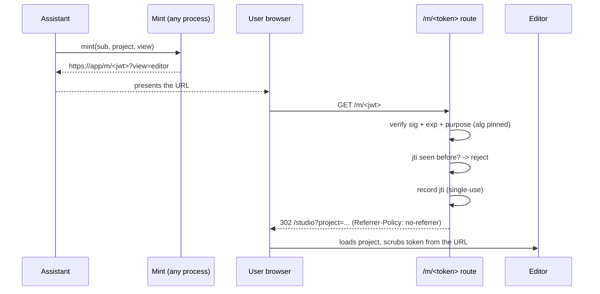

# Magic-link URL handoff

When the assistant finishes a video it hands the user a single URL.
Clicking it drops them straight into the web editor (or the player),
already signed in — no second login, no copy-pasting a project name.
This document specifies the token so the design can be audited from
the doc alone.

## Why a signed JWT, not an opaque token

An opaque token requires a server-side lookup table (token → session)
that must be written on mint and read on redeem, kept consistent
across processes, and garbage-collected. A signed JWT is
**stateless on mint**: the claims (who, which project, which view,
when it expires) travel inside the token and are verified by
signature, so the mint side needs no storage and the token works the
moment it is created — including when minted from a different process
than the one that redeems it.

The one thing a JWT cannot do by itself is *single-use*. That is
solved with a small redeemed-id cache (below). Everything else —
expiry, integrity, audience — is in the signature.

## Token format

A compact JWS, `HS256`, signed with the application session secret.

| Claim | Meaning |
|---|---|
| `sub` | the owning user id (scopes which projects the link can open) |
| `project` | the project the link opens |
| `view` | `editor` or `video` |
| `iat` | issued-at (epoch seconds) |
| `exp` | expiry — **at most 5 minutes** after `iat` |
| `jti` | a v4 UUID — the single-use id (122 bits of entropy) |
| `purpose` | constant `magic_link` — distinguishes these from the app's other (RS256) tokens |

The signing algorithm is **pinned to a one-element allow-list**
(`["HS256"]`) at verification. It is never read from the token
header and `none` is never accepted — this closes the classic JWT
algorithm-confusion class (e.g. presenting an RS256/`none` token, or
an HS-signed token using a public key as the secret).

## Redemption flow

Failure (bad signature, expired, replayed, wrong purpose) returns a
friendly "link expired or already used" page — never a stack trace,
never a hint about which check failed.

## Replay prevention

Redemption records the token's `jti` in an in-memory cache before
returning success; a second presentation of the same `jti` is
rejected. The cache entry is retained at least as long as the token
could possibly be valid, so a replay can never outlive its own
expiry window.

The cache **fails closed**: if the signing key or the cache is
unavailable, redemption rejects the token rather than letting it
through. There is no fail-open path.

> Operational note: the cache is process-local. The service runs as a
> single instance today; a shared cache (e.g. Redis) is the documented
> upgrade path for horizontal scale. A replayed link on a *different*
> instance would still be bounded by the ≤5-minute expiry.

## TTL rationale — why 5 minutes

The link is meant to be clicked now, by the person the assistant is
talking to. Five minutes comfortably covers "assistant prints URL →
user clicks" while keeping the exposure window small: tokens in URLs
leak via browser history, referer headers, proxy and access logs, and
shoulder-surfing. A short TTL means a leaked link is almost always
already dead, and combined with single-use it is dead after the first
legitimate click regardless. The 5-minute ceiling is a hard cap
enforced at mint — a caller cannot request longer.

## Token confidentiality

- The redemption route strips the token from the request path before
  it reaches the access log; only the `jti` is logged, for
  correlation.
- Every `/m/...` response sets `Referrer-Policy: no-referrer` so the
  token cannot leak to third parties via the `Referer` header.
- After the editor loads, the browser URL is replaced with the clean
  canonical path so the token is not left in history or bookmarks.
- The route is rate-limited (defense-in-depth on top of the 122-bit
  `jti`); the edge WAF is the authoritative limiter.

## Signing-key rotation playbook

The token is signed with the application session secret.

1. Rotate the secret in the secret store.
2. Roll the service so every process picks up the new secret.
3. **Blast radius:** only links minted in the last ≤5 minutes are
   invalidated (they fail signature verification and show the friendly
   expired page). Because the TTL is so short, no user communication
   is required — anyone affected simply asks the assistant for a fresh
   link. Long-lived sessions are unaffected: the session cookie is
   independent of this token.
4. Verify in staging by minting before rotation and confirming the
   link fails after.

## Security checklist

- [x] `HS256` pinned as an explicit one-element allow-list at verify; `none` impossible
- [x] `exp` ≤ 5 min, hard-capped at mint
- [x] single-use via a 122-bit v4 `jti`; replay rejected
- [x] redeemed-id cache fails **closed** (key/cache error → reject)
- [x] token never logged (only `jti`); path redacted from access logs
- [x] `Referrer-Policy: no-referrer` on all redemption responses
- [x] token scrubbed from the browser URL after load
- [x] `purpose` claim isolates these tokens from other app tokens
- [x] rate-limited endpoint; authoritative limiter at the edge
- [x] friendly failure page — no oracle about which check failed
