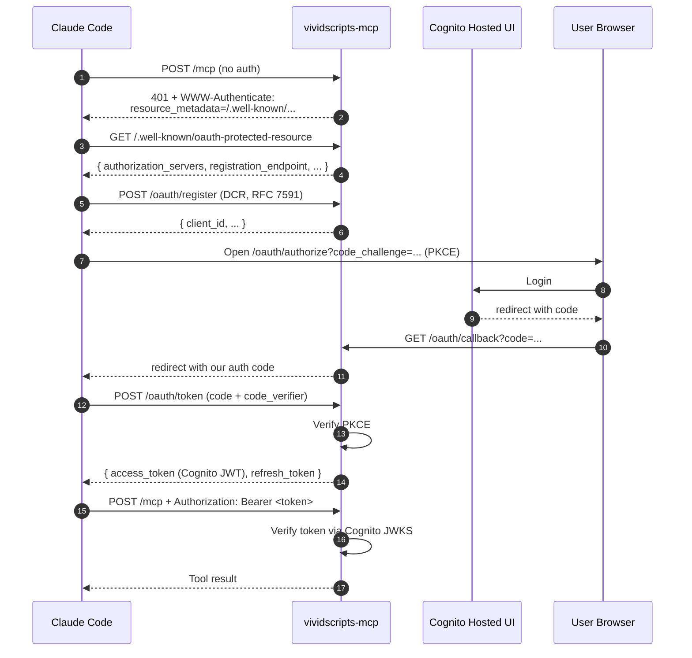

# Security Design

How `vividscripts-mcp` is designed to be safe to host, safe to use, and safe to fork.

This document describes the **security design**. For how to **report** a vulnerability, see [`SECURITY.md`](../SECURITY.md).

---

## What we're protecting against

The threats we take seriously:

- An attacker with no credentials gaining access to a user's projects
- One authenticated user accessing another user's data (cross-tenant)
- A leaked token granting persistent access after the legitimate session ends
- A compromised dependency or PR landing malicious code on `main`
- Secrets being committed accidentally and reaching the public remote
- A magic-link URL leaking via referer/proxy/browser-history and being replayed

The threats we don't worry about (and why):

- **Someone forks the repo.** Source code disclosure does not grant access. Forks run on the forker's infrastructure; reaching production still requires a valid OAuth token issued by our Cognito user pool.
- **Reading the JSON schemas.** Schemas are intentionally public — every API client needs them. The IP is in HOW the AI is prompted, not what shape the output takes.
- **Knowing the OAuth flow design.** The flow is RFC-compliant (OAuth 2.1, RFC 7591, RFC 7636, RFC 9728). Spec disclosure is not a vulnerability.

We rely on cryptography and authentication, not obscurity.

---

## Authentication: OAuth 2.1 + Dynamic Client Registration + PKCE



Design decisions and rationale:

- **PKCE is required.** Any `/oauth/token` request lacking a valid `code_verifier` returns 400 with no fallback. PKCE prevents auth-code interception on the public-client side and is mandatory in OAuth 2.1.
- **Dynamic Client Registration (RFC 7591)** lets Claude Code self-register without us hand-issuing `client_id`s. We require an existing authenticated session before allowing registration — RFC 7591 § 2 explicitly permits this, and it prevents anonymous spamming of the registration endpoint.
- **`redirect_uri` allowlist is exact-match per client.** No wildcards, no globs, no prefix matching. Mismatched URIs are rejected before any user interaction.
- **Cognito JWKS for token verification.** The MCP server fetches Cognito's public JWKS (cached for 1 hour) and verifies every Bearer token's signature against it. Algorithm is pinned: `algorithms=["RS256"]` explicitly — no defaults, no algorithm confusion.
- **Audience and issuer claims are checked.** A token issued for a different resource server or different user pool is rejected even if the signature is valid.
- **Cognito tokens pass through.** We don't re-sign — fewer keys to manage, fewer points of failure. Refresh tokens are handled by Cognito directly via the standard `refresh_token` grant.
- **The `Authorization` header is never logged.** For correlation we log the token's `jti` or a SHA-256 hash of the first 8 characters. Logs in CloudWatch retain for 30 days only.

---

## Authorization: every request scoped to the authenticated user

Every backend operation takes a `user_id` parameter. That `user_id` is **only ever** read from the validated Bearer token — never from the request body, query string, or any header other than `Authorization`.

```
Request → Bearer middleware → g.cognito_sub → BackendProtocol method(user_id=g.cognito_sub, ...)
```

This is enforced structurally: the `BackendProtocol` (see [`src/vividscripts_mcp/adapters/base.py`](../src/vividscripts_mcp/adapters/base.py)) has `user_id` as the first parameter on every method. The MCP dispatcher always passes `g.cognito_sub`. A new tool handler that tries to read `user_id` from the body fails type-check.

Cross-tenant access is impossible by design: a tool call against another user's `project_id` returns a 404 (project not found *for this user*), never a permission error — so probing doesn't even reveal that other users' projects exist.

`project_id` itself is regex-validated at the protocol boundary: `^[A-Za-z0-9_-]+(?: \(\d+\))?$`. Path traversal attempts (`../`, null bytes, unicode confusables) are rejected with 400 before reaching the backend.

---

## Magic-link URL handoff

When a workflow finishes, the server returns a URL like `https://app.vividscripts.com/m/jR8k2x`. Clicking it auto-creates a browser session and lands the user in the editor. Same pattern Notion, Linear, and Vercel use for email magic-links.

### Token format

```json
{
  "sub": "<cognito_sub>",
  "project": "Knocking_Inside",
  "view": "editor",
  "jti": "<random UUID v4>",
  "iat": 1715616000,
  "exp": 1715616300
}
```

Signed with HS256 using `FLASK_SECRET_KEY`. Verified with explicit `algorithms=["HS256"]` — no `None`, no default — preventing algorithm-confusion attacks.

### Replay protection

A magic-link URL leaks easily — referer headers, browser history, proxy logs. We treat that as a baseline assumption and defend in depth:

| Control | Effect |
|---|---|
| 5-minute TTL on `exp` | Stolen link expires before most exfil paths complete |
| `jti` is UUID v4 (122 bits entropy) | Brute-force scanning is infeasible |
| Single-use via `jti` cache | A second click on the same link returns 410 Gone |
| Cache fails CLOSED | If the cache is unavailable, we reject the token rather than risk replay |
| `/m/<token>` is rate-limited | Defense in depth against scanning even with 122-bit entropy |
| Token never appears in logs | Path is stripped before access logging; only `jti` is logged for correlation |

### Session vs. token TTL

The 5-minute TTL is for the **magic-link token**. The session created when the token is redeemed has the same TTL as a normal Cognito session (default ~24 hours). The two are independent — rotating `FLASK_SECRET_KEY` invalidates all in-flight magic-links but does not log out existing sessions.

---

## Schema validation as a defense layer

Every MCP tool input is validated against a Pydantic schema before reaching the backend. Every step result submitted via `save_step_result` is validated against the step's output schema before persistence.

This is defense-in-depth, not the primary check. The primary checks are authentication and authorization. But schema validation catches:

- Type confusion attacks (string where an int was expected)
- Field injection (extra keys that might affect downstream logic)
- Out-of-range numeric values
- Pattern violations (project_id with traversal characters, malformed UUIDs)

Pydantic v2's `ConfigDict(extra="forbid")` is set on every model — unexpected keys are rejected, not silently accepted.

---

## Supply chain

The public repo is a target. We harden it:

| Control | Purpose |
|---|---|
| GitHub Actions: `permissions: contents: read` | Workflows can read the repo but can't write to it, create releases, or post comments. Limits blast radius of any malicious PR that lands in CI. |
| Pre-commit `gitleaks` hook | Scans staged files for secret patterns locally, before push |
| GitHub native secret scanning | Always-on for public repos; catches anything `gitleaks` misses |
| Dependabot (weekly) | Tracks `pip` + `github-actions` ecosystems; PRs for security updates land within days of disclosure |
| Pinned major versions in `pyproject.toml` | New major versions of dependencies require a deliberate update, not a silent install |
| MIT license + `SECURITY.md` reporting policy | Clear contribution and reporting expectations |

Future hardening (tracked in private project planning):

- Branch protection on `main` (block force-push, require status checks)
- CodeQL static analysis in CI
- Signed commits
- Third-party security review before tagging v1.0

---

## Logging

Logging is a security surface in its own right. We minimize what hits the log:

- `Authorization` header: redacted. Never logged in full. Correlation via `jti` or token-hash first 8 chars.
- Magic-link URLs: token stripped from the path before access logging. Only `jti` is recorded.
- User identity: `cognito_sub` only — no emails, no story content, no generated media bytes.
- Error responses: generic externally with a correlation ID; full detail (stack traces, internal paths) goes to internal CloudWatch logs only, never the response body.
- Retention: 30 days CloudWatch (existing setting; no extensions without security review).

---

## Cryptography choices

| Use | Algorithm | Key source | Notes |
|---|---|---|---|
| Bearer token verification | RS256 (Cognito-signed) | Cognito JWKS (rotated by AWS) | `algorithms=["RS256"]` pinned explicitly |
| Magic-link token | HS256 | `FLASK_SECRET_KEY` (Secrets Manager) | `algorithms=["HS256"]` pinned explicitly |
| PKCE code challenge | SHA-256 (S256) | Client-generated `code_verifier` | Plain method (`code_challenge_method=plain`) is rejected |
| TLS | TLS 1.3 minimum | ACM-issued | Enforced at ALB |

In all cases the algorithm is specified explicitly at decode/verify time — no library defaults, no `algorithms=None`, no algorithm-of-the-header trust.

---

## Secrets

All production secrets are in AWS Secrets Manager, loaded by the application at startup via `secrets_manager.py` (in the VividScripts deployment). The public package never contains, references, or depends on a specific secret value — only the env-var names it reads.

Rotation cadence:
- `FLASK_SECRET_KEY` (magic-link signer): annual, or immediately on suspected compromise
- Cognito tokens: rotated by AWS Cognito
- Third-party API keys (Replicate, BFL, Grok): quarterly

Compromise playbook: rotate the affected key, invalidate dependent state (e.g., a new `FLASK_SECRET_KEY` invalidates all in-flight magic-links — 5-minute TTL bounds the impact).

---

## What you can verify yourself

If you're reviewing this repo:

```bash
# 1. No real prompt template bodies in the public source
grep -r "You are" src/                  # → empty

# 2. No accidentally committed secrets
gitleaks detect --source . --no-banner

# 3. GitHub Actions has least-privilege permissions
grep -A1 "^permissions:" .github/workflows/ci.yml
# → contents: read

# 4. Bearer/JWT decoding uses explicit algorithm whitelist
# (will be visible in src/vividscripts_mcp/oauth/ once Phase 1 lands)

# 5. BackendProtocol takes user_id as the first parameter on every method
grep "def " src/vividscripts_mcp/adapters/base.py | grep -v user_id || true
# → empty (every method takes user_id)
```

---

## Reporting

If you find a vulnerability, please follow [`SECURITY.md`](../SECURITY.md) — use [GitHub Security Advisories](https://github.com/EstebanCastorena/vividscripts-mcp/security/advisories/new) or email, not a public issue.

---

## What's deliberately out of this document

- The internal STRIDE threat model with severities, mitigation owners, and ticket references — lives in private project tracking, kept fresh per phase, and not appropriate for public disclosure.
- Operational runbooks for incident response.
- IAM role JSON, Terraform configurations, and infrastructure topology.

If you're evaluating this for security maturity and want more depth than this document provides, reach out via the channels in `SECURITY.md` and we can have a private conversation.
